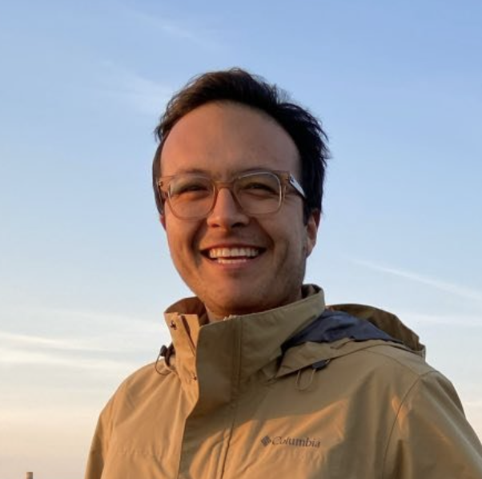

  

I am a Ph.D. candidate in Materials Sciences at [Colorado School of Mines](https://www.mines.edu/), working under the guidance of [Dr. Diego Gómez-Gualdron](https://chemeng.mines.edu/project/gomez-gualdron-diego/). I am part of [ID4 - Institute for Data Driven Dynamical Design](https://www.mines.edu/id4/) where I integrate molecular simulations, high-throughput computing, and machine learning to explore and identify novel materials with potential for energy-related applications.

## Research Interests

My broad research interests lie in the intersection between physics, chemistry, and machine learning to design functional materials. Among my research interests are:

- Development of Data-Driven tools for Rational Materials Design
- Multi-Scale Property-Structure Relationships for Complex Systems Design
- Interfacial Phenomena
- Porous Materials

## News 

- 08/2023: [New Collaboration Paper](https://pubs.acs.org/doi/10.1021/jacs.3c03918): Three solution-stable MOFs were found to facilitate the Singlet Fission process by stabilizing the Charge Transfer state.
- 06/2023: I participated in the seminar sessions of [ID4](https://www.mines.edu/id4/) sharing my work on Application-relevant properties predictions in MOFs using Machine Learning.
- 05/2023: We organized a workshop for professional development with [ADSE](https://www.allianceinscience.org/) at TAMU

## Publications

You can find a complete list of my publications on my [Google Scholar](https://scholar.google.com/citations?user=FpanAPQAAAAJ&hl=en) profile.

## Education

- Present, Colorado School of Mines, Ph.D. Materials Science
- 2021, Universidad de Los Andes, Colombia, Ph.D. Engineering
- 2021, Universidad de Los Andes, Colombia, M.Sc. Chemical Engineering
- 2016, Universidad de Industrial de Santander, Colombia, M.Sc. Hydrocarbon Engineering
- 2013, Universidad de Industrial de Santander, Colombia, B.Sc. Chemical Engineering

## Contact

If you have any questions, would like to discuss potential collaborations, or want to know more about my research, feel free to reach out to me. You can contact me via email at [jfajardorojas@mines.edu](mailto:jfajardorojas@mines.edu) or connect with me on [LinkedIn](https://www.linkedin.com/in/jair-fernando-fajardo-rojas-7a791078/).

Thank you for visiting my website!
